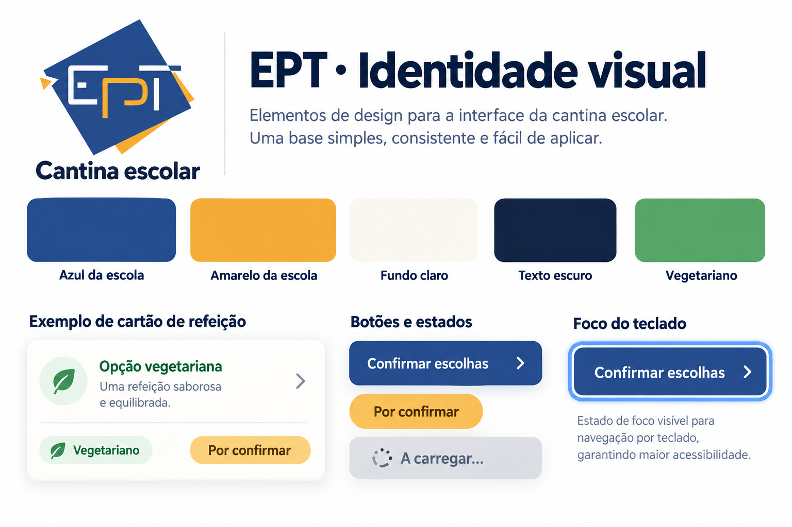
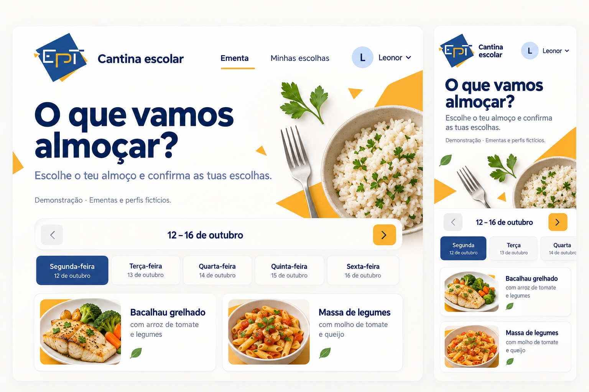
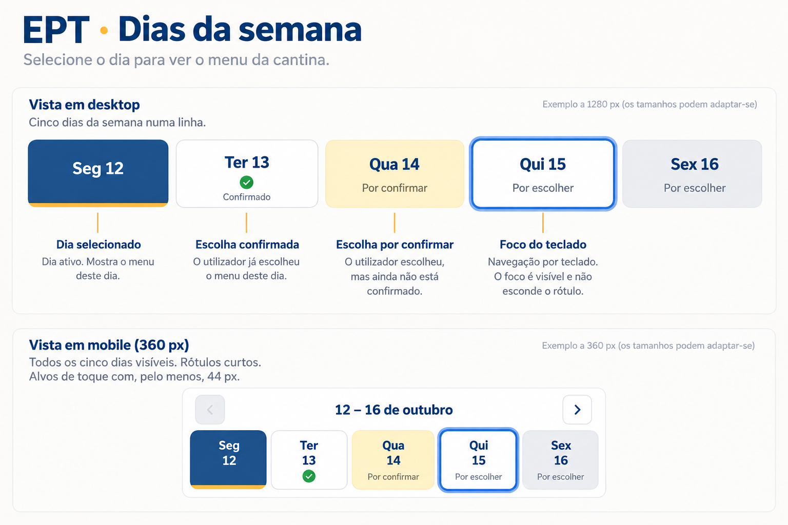
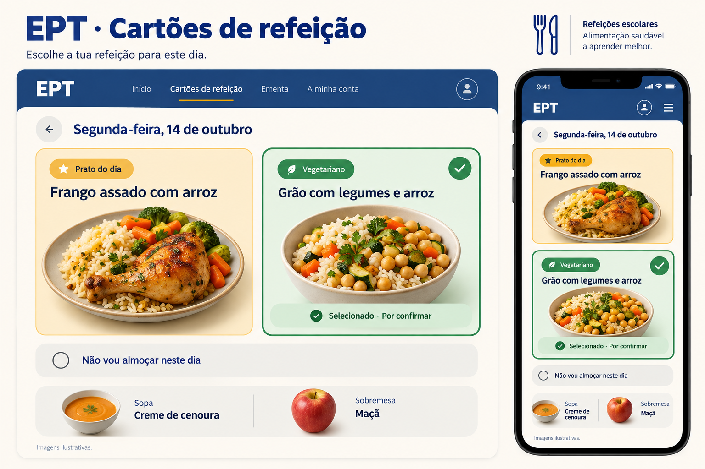
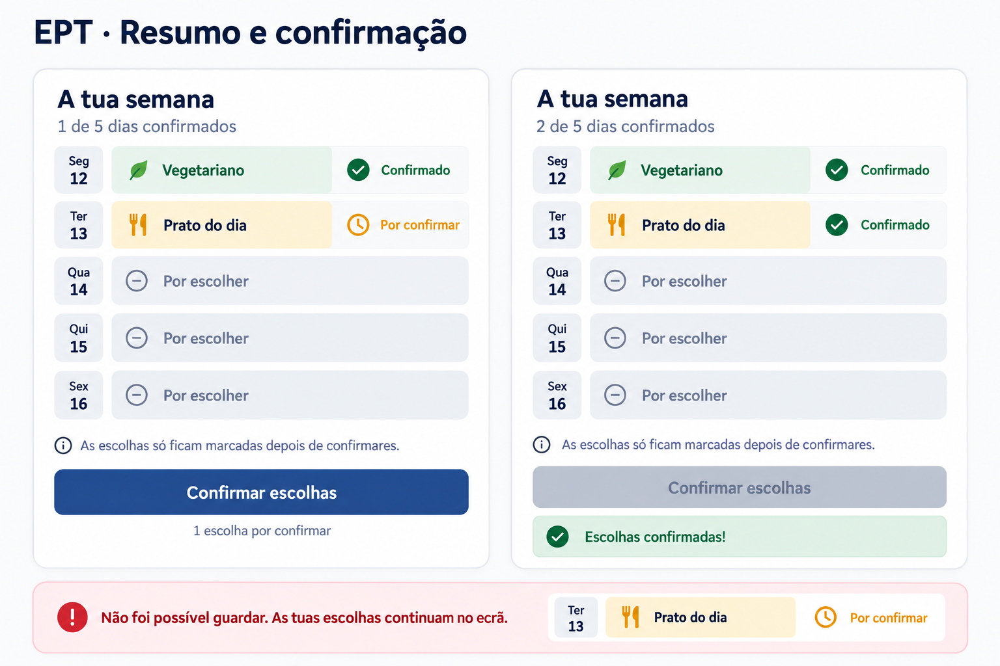
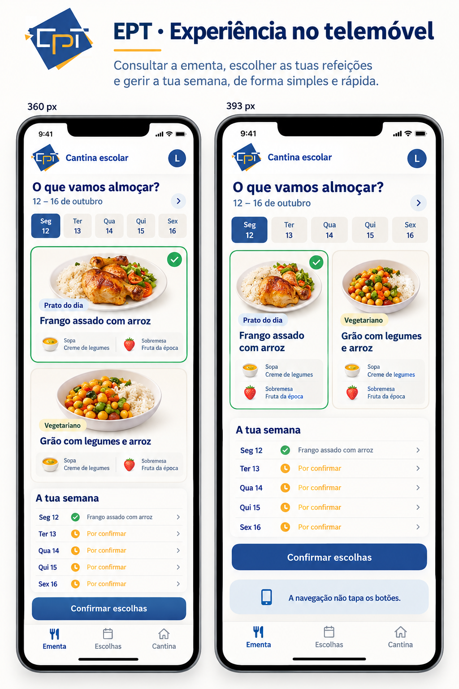

# Referências visuais para a cantina EPT

Proposta de melhoria da interface para alunos do ensino secundário, em português de Portugal. Estas imagens foram geradas com a ferramenta integrada de geração de imagens do Codex. Servem de orientação visual; os requisitos escritos nas tarefas têm prioridade.

## Identidade da escola

O logótipo de referência foi obtido da [imagem pública enviada pelo professor](https://www.facebook.com/photo/?fbid=436731538463638&set=a.436731531796972). Usar o ficheiro oficial da escola quando disponível. Preservar as proporções e as cores; não substituir o símbolo por uma recriação gerada por IA. Os tons das propostas são aproximações visuais, não um manual oficial de identidade.

## Ordem e distribuição do trabalho

1. Identidade visual: base comum de cores e logótipo.
2. Cabeçalho: título e apresentação da página do aluno.
3. Dias da semana: separadores e estados.
4. Cartões de refeição: apresentação das opções.
5. Resumo e confirmação: clareza dos estados e mensagens.
6. Telemóvel: revisão final após integrar as partes anteriores.

Depois da primeira tarefa, as tarefas 2 a 5 podem ser distribuídas por componentes. Como vários alunos vão editar `app/cantina.tsx` e `app/globals.css`, combinar as zonas de trabalho, evitar reformatar ficheiros inteiros e integrar as alterações por partes. Seguir `CONTRIBUTING.md` e associar cada pedido de integração à tarefa correspondente.

## Limites das imagens

Datas, refeições, estados e navegação ilustrados não criam novas regras. Usar os dados e controlos da app. Selecionar uma opção não equivale a confirmar uma marcação. As imagens dos pratos são ilustrativas. A sopa e a sobremesa pertencem ao dia. As permissões, a autenticação e o calendário têm tarefas próprias.

## Instruções usadas para criar as propostas (descrição em português)

- Identidade: quadro com logótipo EPT, azul/amarelo, variáveis de cor, botões e foco de teclado.
- Cabeçalho: vista de computador e telemóvel com título «O que vamos almoçar?», perfil, aviso de demonstração e semana.
- Dias: cinco separadores com dia aberto, escolha pendente, escolha confirmada e foco visível.
- Refeições: dois cartões com ilustrações, seleção explícita, sopa/sobremesa e opção de não almoçar.
- Resumo: comparação antes/depois de guardar e exemplo de erro que mantém a escolha pendente.
- Telemóvel: vistas estreitas com cartões, resumo e navegação inferior que não tapa os controlos.

### 1. aplicar o logótipo e as cores da escola

### 2. criar um cabeçalho mais acolhedor para os alunos

### 3. tornar os dias da semana e os seus estados mais claros

### 4. tornar os cartões das refeições mais apelativos

### 5. melhorar o resumo semanal e a confirmação das escolhas

### 6. rever a nova interface no telemóvel

